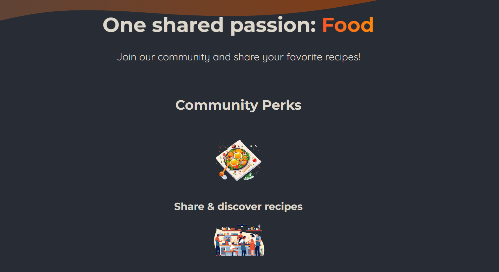

# Foodies

**Foodies** is a responsive website that allows users to explore various dishes, with an intuitive and attractive user interface. It features a dynamic navbar and showcases a list of food items fetched from an API, displayed in organized cards.

## Table of Contents

- [Description](#description)
- [Features](#features)
- [Screenshots](#screenshots)
- [Installation](#installation)
- [Usage](#usage)
- [Technologies](#technologies)
- [Contributing](#contributing)

## Description

Foodies is designed to help users find and explore delicious dishes from various cuisines. The website offers a clean layout with a card design for easy browsing, and it's built using modern web technologies like HTML, CSS, and JavaScript.

## Features

- Dynamic navigation bar
- API-based content fetching and rendering
- Clean and responsive design
- Organized food items displayed in cards

## Screenshots

Here are some screenshots of the website:

### Homepage:


### Menu Section:


### Food Item Detail:


### Community Section:



## Installation

To run the project locally:

1. Clone the repository:
   ```
   git clone https://github.com/ayman-ezzeldin/Foodies.git
2. Install the dependencies:
   ```
    npm install
3. Start the development server:
    ```
   npm run dev

   
## Usage
    You can use the website by exploring different sections through the navbar. The main section fetches content from an API, displaying food items in cards.

## Technologies
  HTML,
  CSS,
  JavaScript,
  React
## Contributing
  If you'd like to contribute to this project, feel free to submit a pull request or open an issue for discussion.
